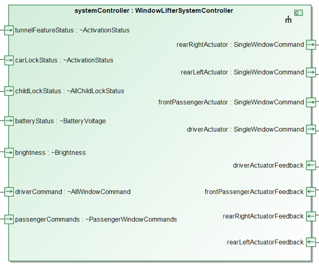
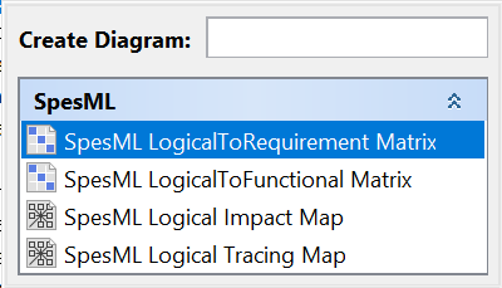

# Logical Viewpoint
The Logical Viewpoint is the functional domain of the SpesML MM concerned with the modeling of the logical components. There are three focus areas in this Viewpoint: the Logical Component Modeling (LCM), the Logical Architecture Modeling (LAM), the Logical Context Modeling (LTM), and the Logical Physical Modeling (LPM). More information on the Logical Viewpoint can be found [here](https://spesml.github.io/concepts/modeling_framework/logical_viewpoint.html).

## Logical Component Modeling (LCM)
This focus area address the component modeling in the logical viewpoint.

### LCM A: For logical components, their interface is modeled with associated input and output signals. 
This is the most basic capability of this focus area, and functional domain. The other capabilities require this capability to be implemented. *Plugin usage*: This is described [here](https://spesml.github.io/plugin/logical_viewpoint.html#how-to-model).

{:class="img-responsive"}

### LCM B: The behavior of the logical components is modeled.  
This capability describes that the logical components have their behavior modeled. *Plugin usage*: In the plugin, state machines are used to model the behavior of components. More information on this can be found [here](https://spesml.github.io/plugin/state_machines.html). Another possibility is to use the state machines from the Functional Viewpoint using a Functional-Logical Adpater. More information on this can be found [here](https://spesml.github.io/plugin/logical_viewpoint.html#functional-logical-adapter).

### LCM C: Logical components and requirements they satisfy are related by a satisfy or require relation.
This capability requires to have the satisfy relation between the component and the requirement to be explicit defined in the models. *Plugin usage*: can be found [here](https://spesml.github.io/plugin/logical_viewpoint.html#spesml-logicaltorequirement-matrix)

{:class="img-responsive"}

## Logical Architecture Modeling (LAM)
This focus area is concerned with the modeling of the relations between components, which form the logical architecture.

### LAM A: The logical components and their dependencies are modeled.
This capability prescribe the connection between modeled components by signal lines. 
{:class="img-responsive"}

### LAM B: Logical components are related to white-box functions that they implement by a realize relation.
The components of the logical viewpoint implement the white-box functions and this is made explicit through a *realize* relation. More on tracing between logical components and functions can be found [here](https://spesml.github.io/concepts/modeling_framework/functional_viewpoint.html#tracing-between-functions-and-elements-of-the-logical-viewpoint).
*Plugin usage*: this information is stored in the SpesML LogicalToFunctional Matrix. More information on this can be found [here](https://spesml.github.io/plugin/logical_viewpoint.html#spesml-logicaltofunctional-matrix).

{:class="img-responsive"}

## Logical conText Modeling (LTM)
In this focus area, the relevant context elements for the logical viewpoint are modeled.

### LTM A: The system under development (i.e., the top-level logical component) is modeled by a composition of all logical components (i.e., internal context).
By having the it modeled from the SUD all the way until 
Pre-req: LAM A and LCM A.

### LTM B: Actors of the operational context (e.g., external systems or users) are modeled with a syntactic interface (inputs and outputs).  
The image below depicts the WindoLifterSytem in the Logical Context view.
{:class="img-responsive"}

##### LTM C: For each actor in the operational context, the behavior is modeled.

{:class="img-responsive"}

The actor also includes external logical components (e.g., BrightnessSensor in the image above)

## Logical Physical Modelling (LPM)  
In the SpesML methodology, physical and mechanical properties of the system are described in the Logical Viewpoint. This focus area describes the possible levels of maturity a development team can achieve when modelling physical information for a SUD.  
  
### LPM A: Physical properties of the system and context are defined using DataTypes.  
  
### LPM B: Physical behaviour of the SUD and Context elements are modelled.  
  
### LPM C: Physical behaviour is used when simulating the logical components.

Quantities are assigned to external logical components. 
##### Physical quantities are modeled using the specific elements of the plugin.
